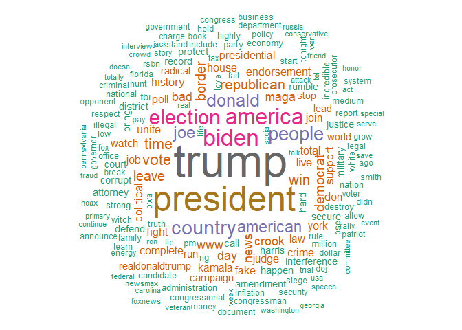
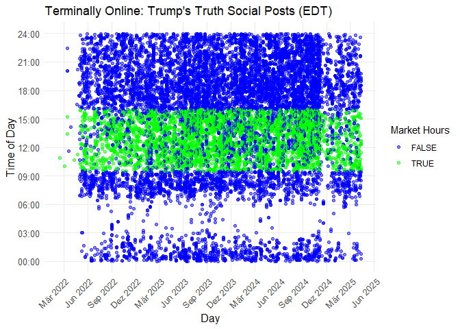
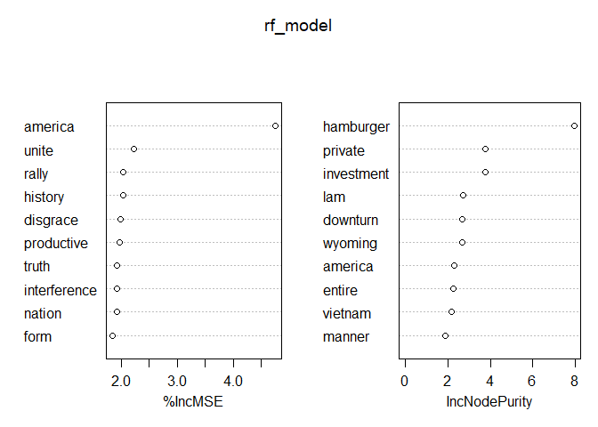
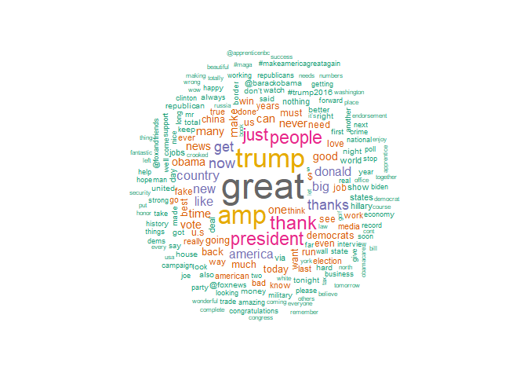

# Load the packages, data and functions

``` r
require(here)
```

```
## Lade nötiges Paket: here
```

```
## here() starts at C:/Users/jonas/Desktop/repos/mmetricsproject
```

``` r
require(stringr)
```

```
## Lade nötiges Paket: stringr
```

``` r
require(dplyr)
```

```
## Lade nötiges Paket: dplyr
```

```
## 
## Attache Paket: 'dplyr'
```

```
## Die folgenden Objekte sind maskiert von 'package:stats':
## 
##     filter, lag
```

```
## Die folgenden Objekte sind maskiert von 'package:base':
## 
##     intersect, setdiff, setequal, union
```

``` r
require(ggplot2)
```

```
## Lade nötiges Paket: ggplot2
```

``` r
require(lubridate)
```

```
## Lade nötiges Paket: lubridate
```

```
## 
## Attache Paket: 'lubridate'
```

```
## Die folgenden Objekte sind maskiert von 'package:base':
## 
##     date, intersect, setdiff, union
```

``` r
require(RColorBrewer)
```

```
## Lade nötiges Paket: RColorBrewer
```

``` r
require(wordcloud)
```

```
## Lade nötiges Paket: wordcloud
```

``` r
require(tidyr)
```

```
## Lade nötiges Paket: tidyr
```

``` r
require(randomForest)
```

```
## Lade nötiges Paket: randomForest
```

```
## randomForest 4.7-1.2
```

```
## Type rfNews() to see new features/changes/bug fixes.
```

```
## 
## Attache Paket: 'randomForest'
```

```
## Das folgende Objekt ist maskiert 'package:ggplot2':
## 
##     margin
```

```
## Das folgende Objekt ist maskiert 'package:dplyr':
## 
##     combine
```

``` r
require(tidytext)
```

```
## Lade nötiges Paket: tidytext
```

``` r
require(textstem)
```

```
## Lade nötiges Paket: textstem
```

```
## Lade nötiges Paket: koRpus.lang.en
```

```
## Lade nötiges Paket: koRpus
```

```
## Lade nötiges Paket: sylly
```

```
## For information on available language packages for 'koRpus', run
## 
##   available.koRpus.lang()
## 
## and see ?install.koRpus.lang()
```

``` r
require(tidyverse)
```

```
## Lade nötiges Paket: tidyverse
```

```
## ── Attaching core tidyverse packages ──────────────────────── tidyverse 2.0.0 ──
## ✔ forcats 1.0.0     ✔ readr   2.1.5
## ✔ purrr   1.0.4     ✔ tibble  3.2.1
## ── Conflicts ────────────────────────────────────────── tidyverse_conflicts() ──
## ✖ randomForest::combine() masks dplyr::combine()
## ✖ dplyr::filter()         masks stats::filter()
## ✖ dplyr::lag()            masks stats::lag()
## ✖ randomForest::margin()  masks ggplot2::margin()
## ✖ readr::tokenize()       masks koRpus::tokenize()
## ℹ Use the conflicted package (<http://conflicted.r-lib.org/>) to force all conflicts to become errors
```

``` r
require(tm)
```

```
## Lade nötiges Paket: tm
## Lade nötiges Paket: NLP
## 
## Attache Paket: 'NLP'
## 
## Das folgende Objekt ist maskiert 'package:ggplot2':
## 
##     annotate
## 
## 
## Attache Paket: 'tm'
## 
## Das folgende Objekt ist maskiert 'package:koRpus':
## 
##     readTagged
```

``` r
require(SnowballC)
```

```
## Lade nötiges Paket: SnowballC
```

``` r
require(quanteda.textplots)
```

```
## Lade nötiges Paket: quanteda.textplots
```

``` r
require(quantmod)
```

```
## Lade nötiges Paket: quantmod
## Lade nötiges Paket: xts
## Lade nötiges Paket: zoo
## 
## Attache Paket: 'zoo'
## 
## Die folgenden Objekte sind maskiert von 'package:base':
## 
##     as.Date, as.Date.numeric
## 
## 
## ######################### Warning from 'xts' package ##########################
## #                                                                             #
## # The dplyr lag() function breaks how base R's lag() function is supposed to  #
## # work, which breaks lag(my_xts). Calls to lag(my_xts) that you type or       #
## # source() into this session won't work correctly.                            #
## #                                                                             #
## # Use stats::lag() to make sure you're not using dplyr::lag(), or you can add #
## # conflictRules('dplyr', exclude = 'lag') to your .Rprofile to stop           #
## # dplyr from breaking base R's lag() function.                                #
## #                                                                             #
## # Code in packages is not affected. It's protected by R's namespace mechanism #
## # Set `options(xts.warn_dplyr_breaks_lag = FALSE)` to suppress this warning.  #
## #                                                                             #
## ###############################################################################
## 
## Attache Paket: 'xts'
## 
## Die folgenden Objekte sind maskiert von 'package:dplyr':
## 
##     first, last
## 
## Lade nötiges Paket: TTR
## Registered S3 method overwritten by 'quantmod':
##   method            from
##   as.zoo.data.frame zoo
```

``` r
require(alphavantager)
```

```
## Lade nötiges Paket: alphavantager
```

``` r
require(quanteda)
```

```
## Lade nötiges Paket: quanteda
## Package version: 4.2.0
## Unicode version: 15.1
## ICU version: 74.1
## Parallel computing: 12 of 12 threads used.
## See https://quanteda.io for tutorials and examples.
## 
## Attache Paket: 'quanteda'
## 
## Das folgende Objekt ist maskiert 'package:zoo':
## 
##     index
## 
## Das folgende Objekt ist maskiert 'package:tm':
## 
##     stopwords
## 
## Die folgenden Objekte sind maskiert von 'package:NLP':
## 
##     meta, meta<-
## 
## Die folgenden Objekte sind maskiert von 'package:koRpus':
## 
##     tokens, types
```

``` r
require(rvest)
```

```
## Lade nötiges Paket: rvest
## 
## Attache Paket: 'rvest'
## 
## Das folgende Objekt ist maskiert 'package:readr':
## 
##     guess_encoding
```

``` r
require(httr)
```

```
## Lade nötiges Paket: httr
## 
## Attache Paket: 'httr'
## 
## Das folgende Objekt ist maskiert 'package:NLP':
## 
##     content
```

``` r
require(xml2)
```

```
## Lade nötiges Paket: xml2
```

``` r
truths_raw <- read.csv(here("data/political_data", "truths_new.csv"))
snp_raw <- read.csv(here("data/market_data", "SPY_24_25.csv"))

source(here("helperfunctions/truths_cleaning_function.R"))
```

# Process the data with the helperfunction

``` r
truths <-truths_processer(truths_raw) # can take one or two minutes
head(truths)
```

```
##   X
## 1 1
## 2 2
## 3 3
## 4 4
## 5 5
## 6 6
##                                                                                                                                                                                                                                                                                                                                                                                                                                                                                                                                                                                                                                                                                                                x
## 1                                                                                                                                                                                                                                                                                                                                                                                                                                                                                                                                                                                                                                     Donald J. Trump @realDonaldTrump · April 11, 2025, 8:12 AM   Original Post
## 2                                                                                                                                                                                                                                                                                                                                                                                                                                                                                                                                                                                                                                    Donald J. Trump @realDonaldTrump · April 11, 2025, 10:05 PM   Original Post
## 3                                                                                                                                                                                                                 Donald J. Trump @realDonaldTrump · April 11, 2025, 7:45 PM   Original Post How could we be expected to go to South Africa for the very important G20 Meeting when Land Confiscation and Genocide is the primary topic of conversation? They are taking the land of white Farmers, and then killing them and their families. The Media refuses to report on this. The United States has held back all contributions to South Africa. Is this where we want to be for the G20? I don’t think so!
## 4                                                                                                                             Donald J. Trump @realDonaldTrump · April 11, 2025, 7:21 PM   Original Post My friend, Douglas Murray, just released a new book, “On Democracies and Death Cults,” and it is quickly becoming a Best Seller! Based on his firsthand reporting, Douglas documents the barbarity of Hamas’ brutal attack on Israel on October 7th, and Israel’s heroic response. The Book serves as a strong reminder of why we must always stand up for America, and our great friend and ally, Israel. A powerful read from a Highly Respected author - Get your copy today! https://a.co/d/c1JHUcL
## 5 Donald J. Trump @realDonaldTrump · April 11, 2025, 12:42 PM   Original Post “Trump’s first three Cabinet meetings feature more press questions and answers than all of Biden’s” https://www.washingtontimes.com/news/2025/apr/10/trumps-first-three-cabinet-meetings-feature-press-questions-answers/   www.washingtontimes.com Trump’s first three Cabinet meetings feature more press questions and answers than all of Biden’s President Trump answered nearly 100 questions from the press during his first three Cabinet meetings this year — nearly 20 times the number answered by President Biden in the same setting during four years in office, according to data compiled by The Washington Times.
## 6                                                                                                                                                    Donald J. Trump @realDonaldTrump · April 11, 2025, 12:39 PM   Original Post “President Trump Is Saving Social Security and Stopping Fraud – Don’t Believe Media Lies” https://amac.us/newsline/society/president-trump-is-saving-social-security-and-stopping-fraud-dont-believe-media-lies/   amac.us President Trump Is Saving Social Security and Stopping Fraud – Don’t Believe Media Lies | @AmacforAmerica Trump Social Security reforms improve service and eliminate fraud — ensuring seniors get the benefits they deserve without waste or abuse.
##                  date_time    date_time_parsed        day  time time_numeric
## 1  April 11, 2025, 8:12 AM 2025-04-11 08:12:00 2025-04-11 08:12      8.20000
## 2 April 11, 2025, 10:05 PM 2025-04-11 22:05:00 2025-04-11 22:05     22.08333
## 3  April 11, 2025, 7:45 PM 2025-04-11 19:45:00 2025-04-11 19:45     19.75000
## 4  April 11, 2025, 7:21 PM 2025-04-11 19:21:00 2025-04-11 19:21     19.35000
## 5 April 11, 2025, 12:42 PM 2025-04-11 12:42:00 2025-04-11 12:42     12.70000
## 6 April 11, 2025, 12:39 PM 2025-04-11 12:39:00 2025-04-11 12:39     12.65000
##   time_shifted
## 1     -3.80000
## 2     10.08333
## 3      7.75000
## 4      7.35000
## 5      0.70000
## 6      0.65000
##                                                                                                                                                                                                                                                                                                                                                                                                                                                                                                            post
## 1                                                                                                                                                                                                                                                                                                                                                                                                                                                                                                              
## 2                                                                                                                                                                                                                                                                                                                                                                                                                                                                                                              
## 3                                                                                           How could we be expected to go to South Africa for the very important G20 Meeting when Land Confiscation and Genocide is the primary topic of conversation? They are taking the land of white Farmers, and then killing them and their families. The Media refuses to report on this. The United States has held back all contributions to South Africa. Is this where we want to be for the G20? I don’t think so!
## 4                             My friend, Douglas Murray, just released a new book, “On Democracies and Death Cults,” and it is quickly becoming a Best Seller! Based on his firsthand reporting, Douglas documents the barbarity of Hamas’ brutal attack on Israel on October 7th, and Israel’s heroic response. The Book serves as a strong reminder of why we must always stand up for America, and our great friend and ally, Israel. A powerful read from a Highly Respected author - Get your copy today! 
## 5 “Trump’s first three Cabinet meetings feature more press questions and answers than all of Biden’s”    www.washingtontimes.com Trump’s first three Cabinet meetings feature more press questions and answers than all of Biden’s President Trump answered nearly 100 questions from the press during his first three Cabinet meetings this year — nearly 20 times the number answered by President Biden in the same setting during four years in office, according to data compiled by The Washington Times.
## 6                                                                                                                                                     “President Trump Is Saving Social Security and Stopping Fraud – Don’t Believe Media Lies”    amac.us President Trump Is Saving Social Security and Stopping Fraud – Don’t Believe Media Lies | @AmacforAmerica Trump Social Security reforms improve service and eliminate fraud — ensuring seniors get the benefits they deserve without waste or abuse.
##   media link
## 1     1    0
## 2     1    0
## 3     0    0
## 4     0    0
## 5     0    0
## 6     0    0
##                                                                                                                                                                                                                                                                                                                                                                                                                                                                                                      post_lower
## 1                                                                                                                                                                                                                                                                                                                                                                                                                                                                                                              
## 2                                                                                                                                                                                                                                                                                                                                                                                                                                                                                                              
## 3                                                                                           how could we be expected to go to south africa for the very important g20 meeting when land confiscation and genocide is the primary topic of conversation? they are taking the land of white farmers, and then killing them and their families. the media refuses to report on this. the united states has held back all contributions to south africa. is this where we want to be for the g20? i don’t think so!
## 4                             my friend, douglas murray, just released a new book, “on democracies and death cults,” and it is quickly becoming a best seller! based on his firsthand reporting, douglas documents the barbarity of hamas’ brutal attack on israel on october 7th, and israel’s heroic response. the book serves as a strong reminder of why we must always stand up for america, and our great friend and ally, israel. a powerful read from a highly respected author - get your copy today! 
## 5 “trump’s first three cabinet meetings feature more press questions and answers than all of biden’s”    www.washingtontimes.com trump’s first three cabinet meetings feature more press questions and answers than all of biden’s president trump answered nearly 100 questions from the press during his first three cabinet meetings this year — nearly 20 times the number answered by president biden in the same setting during four years in office, according to data compiled by the washington times.
## 6                                                                                                                                                     “president trump is saving social security and stopping fraud – don’t believe media lies”    amac.us president trump is saving social security and stopping fraud – don’t believe media lies | @amacforamerica trump social security reforms improve service and eliminate fraud — ensuring seniors get the benefits they deserve without waste or abuse.
##                                                                                                                                                                                                                                                                                  tokens
## 1                                                                                                                                                                                                                                                                                      
## 2                                                                                                                                                                                                                                                                                      
## 3                                                                                                    expect, south, africa, meet, land, confiscation, genocide, primary, topic, conversation, take, white, farmer, kill, family, medium, refuse, report, unite, hold, contribution, don
## 4 friend, douglas, murray, release, book, democracy, death, cult, quickly, seller, base, firsthand, report, document, barbarity, hamas, brutal, attack, israel, october, heroic, response, serve, strong, reminder, stand, america, ally, powerful, read, highly, respect, author, copy
## 5                                                                                                                              trump, cabinet, meeting, feature, press, question, answer, biden, www, washingtontimes, president, answer, time, set, office, datum, compile, washington
## 6                                                                                                    president, trump, save, social, security, stop, fraud, don, medium, lie, amac, amacforamerica, reform, improve, service, eliminate, ensure, senior, benefit, deserve, waste, abuse
```
This does multiple things. Mainly it turns the scrapped data that is a string per post, cleans it and tokenizes the post. It separates the date and prepares the date to make the plots below by creating many colums.

The second part tokenizes the tweets and lemmatizes them. This means each word becomes an "obersvation and all observations are collected on the post level. Then the words are also lemmatized, meaning reduced to their basic form. For example is becomes be, runnin or ran become run ect.


#Wordcloud
We remove the Tweets that only contain links or nothing at all from the dataset

``` r
truths_main <- truths %>%
  filter(link != 1, media != 1)
```


``` r
all_tokens <- unlist(truths_main$tokens)

word_freqs <- table(all_tokens)
```


``` r
count_token_occurrences <- function(data, word) {
  sum(sapply(data$tokens, function(token_list) {
    sum(token_list == word)
  }))
}
```


``` r
count_token_occurrences(truths_main, "https")
```

```
## [1] 74
```


``` r
wordcloud(
  words = names(word_freqs),
  freq = as.numeric(word_freqs),
  min.freq = 300,  # adjust depending on how important it is
  max.words = 400,
  random.order = FALSE,
  colors = brewer.pal(8, "Dark2")
)
```

<!-- -->

From this wordcloud we can gather some of the most used words by trump. Now the question is: how much does he post during open markets? For that we can plot each post on a time plot:


``` r
weekday_names <- c("Monday", "Tuesday", "Wednesday", "Thursday", "Friday", "Saturday", "Sunday")

truths_main <- truths_main %>%
  mutate(
    weekday = weekday_names[wday(day, week_start = 1)],
    is_market_hour = case_when(
      weekday %in% c("Monday", "Tuesday", "Wednesday", "Thursday", "Friday") &
        time_shifted >= (-2.5) & time_shifted <= 4 ~ TRUE,
      TRUE ~ FALSE
    )
  )
```


``` r
ggplot(truths_main, aes(x = day, y = time_shifted)) +
  geom_point(aes(color = is_market_hour), alpha = 0.5) +
  
  # Custom colors for market vs non-market hours
  scale_color_manual(values = c("FALSE" = "blue", "TRUE" = "green")) +
  
  scale_y_continuous(
    breaks = seq(-12, 12, by = 3),
    labels = c("00:00", "03:00", "06:00", "09:00", "12:00", "15:00", "18:00", "21:00", "24:00")
  ) +
  labs(title = "Terminally Online: Trump's Truth Social Posts (EDT)",
       x = "Day",
       y = "Time of Day",
       color = "Market Hours") +
  
  theme_minimal() +
  
  scale_x_date(
    date_labels = "%b %Y",
    date_breaks = "3 months"
  ) +
  
  theme(axis.text.x = element_text(angle = 45, hjust = 1)) +
  
  theme(
    panel.grid.minor = element_blank(),
    panel.grid.major = element_line(linewidth = 0.5),
    axis.title = element_text(size = 12),
    axis.text = element_text(size = 10)
  )
```

<!-- -->

Now lets get only those tweets

``` r
truths_market <- truths_main %>%
  filter(is_market_hour != FALSE)
```

now get the open and close


``` r
snp_data <- snp_raw %>%
  mutate(timestamp = dmy_hm(timestamp))


truths_market <- truths_market %>%
  mutate(post_time = ymd_hms(date_time_parsed))  # Rename or reuse as needed

# Join on exact datetime
truths_market <- truths_market %>%
  left_join(snp_data, by = c("post_time" = "timestamp"))
```


``` r
truths_market <- truths_market %>%
  mutate(minute_return = Open - Close)

truths_market <- truths_market %>%
  filter(!is.na(Open))
```


``` r
# First, ensure tokens are characters and unnest them
truths_unnested <- truths_market %>%
  select(minute_return, tokens) %>%#only select dependent value and tokens
  mutate(tokens = lapply(tokens, as.character)) %>% # turn them into characters
  unnest(tokens) %>% #unnest the tokens
  mutate(token_present = 1)# just shows if any token is present or if any row is empty
# at this point we have a dataframe that has one column where each token is on a separate row (so if a minute return has 3 tokens it has 3 rows
#each with one token)


# Now, we widen the data, making sure only tokens are pivoted
token_wide_df <- truths_unnested %>%
  pivot_wider(
    names_from = tokens,
    values_fn = max,
    values_from = token_present,
  )
# This basically makes it so each unique token has a column and there is only 1 row for each unique value of minute_return again. Then you have a 
# wide dataframe where each column represents a token that is NA if that token doesnt exist in a post (given by minute return) or 1 if it is in there


# Check the result
print(token_wide_df)
```

```
## # A tibble: 1,049 × 5,863
##    minute_return trump cabinet meeting feature press question answer biden   www
##            <dbl> <dbl>   <dbl>   <dbl>   <dbl> <dbl>    <dbl>  <dbl> <dbl> <dbl>
##  1       -0.740      1       1       1       1     1        1      1     1     1
##  2        0.440      1      NA      NA      NA    NA       NA     NA    NA    NA
##  3        0.350      1      NA      NA      NA    NA       NA     NA    NA    NA
##  4        0.560      1      NA      NA      NA    NA       NA     NA    NA    NA
##  5       -0.390      1      NA      NA      NA    NA       NA     NA    NA    NA
##  6       -0.790     NA      NA      NA      NA    NA       NA     NA    NA    NA
##  7        0.0200     1      NA      NA      NA    NA       NA     NA    NA    NA
##  8        0.525     NA      NA      NA      NA    NA       NA     NA    NA    NA
##  9        0.0900     1      NA      NA      NA    NA       NA     NA    NA     1
## 10       -1.83      NA      NA      NA      NA    NA       NA     NA    NA    NA
## # ℹ 1,039 more rows
## # ℹ 5,853 more variables: washingtontimes <dbl>, president <dbl>, time <dbl>,
## #   set <dbl>, office <dbl>, datum <dbl>, compile <dbl>, washington <dbl>,
## #   save <dbl>, social <dbl>, security <dbl>, stop <dbl>, fraud <dbl>,
## #   don <dbl>, medium <dbl>, lie <dbl>, amac <dbl>, amacforamerica <dbl>,
## #   reform <dbl>, improve <dbl>, service <dbl>, eliminate <dbl>, ensure <dbl>,
## #   senior <dbl>, benefit <dbl>, deserve <dbl>, waste <dbl>, abuse <dbl>, …
```


``` r
#Replace NA with 0
token_wide_df[ , -1] <- token_wide_df[ , -1] %>% replace(is.na(.), 0) #due to problems to do it during change we only now convert the NA to 0s
colnames(token_wide_df) <- make.names(colnames(token_wide_df))
rfdf <- na.omit(token_wide_df)
```


``` r
# Random Forest Model
train_index <- sample(1:nrow(rfdf), size = 0.8 * nrow(rfdf))  # 80% training data
train_data <- rfdf[train_index, ]
test_data <- rfdf[-train_index, ]

rf_model <- randomForest(minute_return ~ ., data = train_data, importance = TRUE, ntree = 10)
#importance(rf_model)
varImpPlot(rf_model, n.var = 10)
```

<!-- -->


# This is the Tweet wordcloud
He was banned in 2021 after Jan 6 so this is when the tweets stop


``` r
tweets <- read.csv(here("data/political_data", "tweets.csv"))

#Only keep original Tweets
tweets <- tweets %>% filter(isRetweet != "t")
tokens <- tokens(tweets$text)
dfm <- dfm(tokens)
```


``` r
corpus_tweets <- corpus(tweets$text)
```


``` r
additional_words <- c("@realdonaldtrump")
all_stopwords <- c(stopwords("en"), additional_words)
```


``` r
tokens_tweets <- tokens(corpus_tweets,  
                        remove_punct = TRUE, 
                        remove_numbers = TRUE)

tokens_tweets <- tokens_remove(tokens_tweets, all_stopwords)  # Remove stopwords
```


``` r
dfm_tweets <- dfm(tokens_tweets)
```


``` r
textplot_wordcloud(dfm_tweets, min_count = 400, color = RColorBrewer::brewer.pal(8, "Dark2"))
```

<!-- -->


