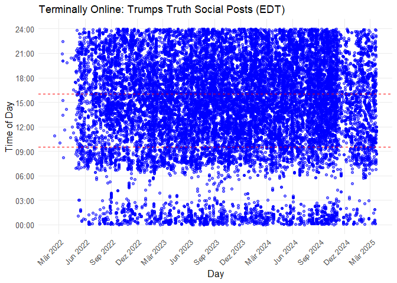

``` r
require(here)
```

```
## Lade nötiges Paket: here
```

```
## here() starts at C:/Users/jonas/Nextcloud/jonas/71_UNIL/Sem_2/Macroeconometrics/Project/git/mmetricsproject
```

``` r
require(stringr)
```

```
## Lade nötiges Paket: stringr
```

``` r
require(dplyr)
```

```
## Lade nötiges Paket: dplyr
```

```
## 
## Attache Paket: 'dplyr'
```

```
## Die folgenden Objekte sind maskiert von 'package:stats':
## 
##     filter, lag
```

```
## Die folgenden Objekte sind maskiert von 'package:base':
## 
##     intersect, setdiff, setequal, union
```

``` r
require(ggplot2)
```

```
## Lade nötiges Paket: ggplot2
```

``` r
require(lubridate)
```

```
## Lade nötiges Paket: lubridate
```

```
## 
## Attache Paket: 'lubridate'
```

```
## Die folgenden Objekte sind maskiert von 'package:base':
## 
##     date, intersect, setdiff, union
```


``` r
truths_raw <- read.csv(here("data", "trump_all_truths.csv"))
```


``` r
truths <- truths_raw %>%
 mutate(
    # Extract the full date and time
    date_time = str_extract(x, "\\b[A-Za-z]+ \\d{1,2}, \\d{4}, \\d{1,2}:\\d{2} [APM]{2}\\b"),
    
    # Convert 'date_time' to proper Date-Time format
    date_time_parsed = mdy_hm(date_time),  # Use mdy_hm() to parse the datetime
    
    # Extract date only for plot
    day = as.Date(date_time_parsed),
    
    # Extract time only for plot
    time = format(date_time_parsed, "%H:%M"),
    
    # Convert time to numeric hours & minutes as fractions
    time_numeric = hour(date_time_parsed) + minute(date_time_parsed) / 60,
    
    # Shift time such that y = 0 corresponds to 12 PM
    time_shifted = time_numeric - 12  # Subtract 12 to make 12 PM = 0
  )
```


``` r
# Create the scatter plot
ggplot(truths, aes(x = day, y = time_shifted)) +
  geom_point(alpha = 0.5, color = "blue") +  # Scatter plot with transparency to handle overplotting
  scale_y_continuous(
    breaks = seq(-12, 12, by = 3),  # Set breaks for every 3 hours (-12, -9, -6, ..., 12)
    labels = c("00:00", "03:00", "06:00", "09:00", "12:00", "15:00", "18:00", "21:00", "24:00")  # 24-hour format labels
  ) +
  labs(title = "Terminally Online: Trumps Truth Social Posts (EDT)",
       x = "Day",
       y = "Time of Day") +
  theme_minimal() +
  
  # quarterly breaks and better readability
  scale_x_date(
    date_labels = "%b %Y",  # Format labels to show month and year
    date_breaks = "3 months"  # quarterly
  ) +
  
  # Rotate the x-axis
  theme(axis.text.x = element_text(angle = 45, hjust = 1)) +
  
  # Add vertical lines at 9:30 AM and 4:00 PM for stock market
  geom_hline(yintercept = (9 + 30 / 60) - 12, linetype = "dashed", color = "red") + 
  geom_hline(yintercept = 16 - 12, linetype = "dashed", color = "red") +   
  
  # theme adjustments
  theme(
    panel.grid.minor = element_blank(),  # Remove minor gridlines
    panel.grid.major = element_line(linewidth = 0.5),  # Major gridlines
    axis.title = element_text(size = 12),
    axis.text = element_text(size = 10)
  )
```

<!-- -->


