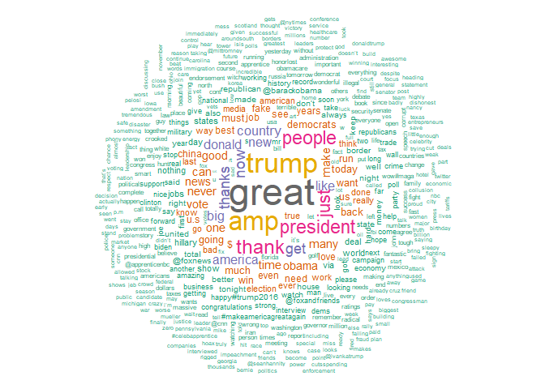

``` r
# Load libraries
library(tm)
```

```
## Lade nötiges Paket: NLP
```

``` r
library(wordcloud)
```

```
## Lade nötiges Paket: RColorBrewer
```

``` r
library(SnowballC)
library(RColorBrewer)
library(dplyr)
```

```
## 
## Attache Paket: 'dplyr'
```

```
## Die folgenden Objekte sind maskiert von 'package:stats':
## 
##     filter, lag
```

```
## Die folgenden Objekte sind maskiert von 'package:base':
## 
##     intersect, setdiff, setequal, union
```

``` r
library(quanteda.textplots)
library(quantmod)
```

```
## Lade nötiges Paket: xts
```

```
## Lade nötiges Paket: zoo
```

```
## 
## Attache Paket: 'zoo'
```

```
## Die folgenden Objekte sind maskiert von 'package:base':
## 
##     as.Date, as.Date.numeric
```

```
## 
## ######################### Warning from 'xts' package ##########################
## #                                                                             #
## # The dplyr lag() function breaks how base R's lag() function is supposed to  #
## # work, which breaks lag(my_xts). Calls to lag(my_xts) that you type or       #
## # source() into this session won't work correctly.                            #
## #                                                                             #
## # Use stats::lag() to make sure you're not using dplyr::lag(), or you can add #
## # conflictRules('dplyr', exclude = 'lag') to your .Rprofile to stop           #
## # dplyr from breaking base R's lag() function.                                #
## #                                                                             #
## # Code in packages is not affected. It's protected by R's namespace mechanism #
## # Set `options(xts.warn_dplyr_breaks_lag = FALSE)` to suppress this warning.  #
## #                                                                             #
## ###############################################################################
```

```
## 
## Attache Paket: 'xts'
```

```
## Die folgenden Objekte sind maskiert von 'package:dplyr':
## 
##     first, last
```

```
## Lade nötiges Paket: TTR
```

```
## Registered S3 method overwritten by 'quantmod':
##   method            from
##   as.zoo.data.frame zoo
```

``` r
library(alphavantager)
library(quanteda)
```

```
## Package version: 4.1.0
## Unicode version: 15.1
## ICU version: 74.1
```

```
## Parallel computing: 12 of 12 threads used.
```

```
## See https://quanteda.io for tutorials and examples.
```

```
## 
## Attache Paket: 'quanteda'
```

```
## Das folgende Objekt ist maskiert 'package:zoo':
## 
##     index
```

```
## Das folgende Objekt ist maskiert 'package:tm':
## 
##     stopwords
```

```
## Die folgenden Objekte sind maskiert von 'package:NLP':
## 
##     meta, meta<-
```

``` r
library(ggplot2)
```

```
## 
## Attache Paket: 'ggplot2'
```

```
## Das folgende Objekt ist maskiert 'package:NLP':
## 
##     annotate
```

``` r
library(lubridate)
```

```
## 
## Attache Paket: 'lubridate'
```

```
## Die folgenden Objekte sind maskiert von 'package:base':
## 
##     date, intersect, setdiff, union
```

``` r
library(rvest)
library(httr)
```

```
## 
## Attache Paket: 'httr'
```

```
## Das folgende Objekt ist maskiert 'package:NLP':
## 
##     content
```

``` r
library(tidyverse)
```

```
## ── Attaching core tidyverse packages ──────────────────────── tidyverse 2.0.0 ──
## ✔ forcats 1.0.0     ✔ stringr 1.5.1
## ✔ purrr   1.0.2     ✔ tibble  3.2.1
## ✔ readr   2.1.5     ✔ tidyr   1.3.1
```

```
## ── Conflicts ────────────────────────────────────────── tidyverse_conflicts() ──
## ✖ ggplot2::annotate()     masks NLP::annotate()
## ✖ httr::content()         masks NLP::content()
## ✖ dplyr::filter()         masks stats::filter()
## ✖ xts::first()            masks dplyr::first()
## ✖ readr::guess_encoding() masks rvest::guess_encoding()
## ✖ dplyr::lag()            masks stats::lag()
## ✖ xts::last()             masks dplyr::last()
## ℹ Use the conflicted package (<http://conflicted.r-lib.org/>) to force all conflicts to become errors
```

``` r
library(lubridate)
library(xml2)
library(here)
```

```
## here() starts at C:/Users/jonas/Nextcloud/jonas/71_UNIL/Sem_2/Macroeconometrics/Project/git/mmetricsproject
```


``` r
tweets <- read.csv(here("data", "tweets.csv"))

#Only keep original Tweets
tweets <- tweets %>% filter(isRetweet != "t")
tokens <- tokens(tweets$text)
dfm <- dfm(tokens)
```


``` r
corpus_tweets <- corpus(tweets$text)
```


``` r
additional_words <- c("@realdonaldtrump")
all_stopwords <- c(stopwords("en"), additional_words)
```


``` r
tokens_tweets <- tokens(corpus_tweets,  
                        remove_punct = TRUE, 
                        remove_numbers = TRUE)

tokens_tweets <- tokens_remove(tokens_tweets, all_stopwords)  # Remove stopwords
```


``` r
dfm_tweets <- dfm(tokens_tweets)
```


``` r
textplot_wordcloud(dfm_tweets, min_count = 5, color = RColorBrewer::brewer.pal(8, "Dark2"))
```

<!-- -->


